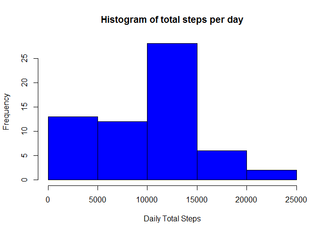
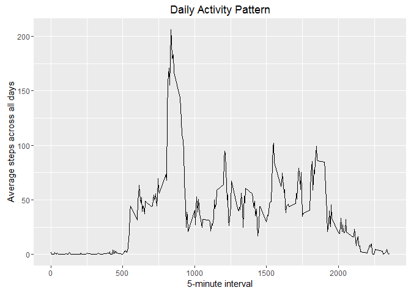
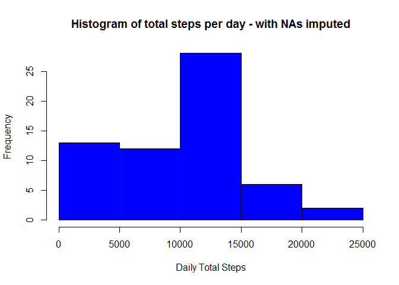
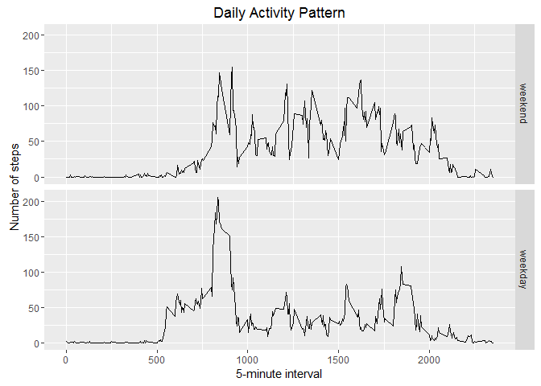

# Reproducible Research: Peer Assessment 1
Anu Rekha T  
August 16, 2016  


## Loading and preprocessing the data
Load the data by using the *read.csv()* function and prepare two summary datasets. 
  
  * Daily summary across all intervals &nbsp;
  * Interval summary across all days

### Load data

```r
activities <- read.csv("activity.csv")
```

### Pre-process data
Using *dplyr* package, let's summarize the total, mean and median steps as daily summary and interval summary


```r
library(dplyr)
```

```
## 
## Attaching package: 'dplyr'
```

```
## The following objects are masked from 'package:stats':
## 
##     filter, lag
```

```
## The following objects are masked from 'package:base':
## 
##     intersect, setdiff, setequal, union
```

```r
dly_smry_activities <- activities %>% group_by(date) %>% 
  summarize(total_steps = sum(steps, na.rm = TRUE),
            mean_steps = mean(steps, na.rm = TRUE),
            median_steps = median(steps, na.rm = TRUE))

intvl_smry_activities <- activities %>% group_by(interval) %>% 
  summarize(total_steps = sum(steps, na.rm = TRUE), 
            mean_steps = mean(steps, na.rm = TRUE),
            median_steps = median(steps, na.rm = TRUE))
```


## What is mean total number of steps taken per day?
Here's a histogram of the total number of steps taken each day.


```r
hist(dly_smry_activities$total_steps, xlab = "Daily Total Steps", 
     main = "Histogram of total steps per day", col = "blue")
```

<!-- -->

Now let's calculate and print the mean and median of the total number of steps taken per day.


```r
mean(dly_smry_activities$total_steps)
```

```
## [1] 9354.23
```

```r
median(dly_smry_activities$total_steps)
```

```
## [1] 10395
```

## What is the average daily activity pattern?

Using ggplot2 package to plot a time-series plot of the 5-minute interval and the average number of steps taken, averaged across all days. 


```r
library(ggplot2)
g <- ggplot(intvl_smry_activities, aes(interval, mean_steps)) + geom_line()
g <- g + ggtitle("Daily Activity Pattern") + labs(x= "5-minute interval", y= "Average steps across all days")
print(g)
```

<!-- -->

Calculating which 5-minute interval, on average across all the days in the dataset, contains the maximum number of steps.


```r
intvl_smry_activities[which.max(intvl_smry_activities$total_steps),]$interval
```

```
## [1] 835
```

## Imputing missing values

In all the above calculations we ignored or removed the **NA** values. Since this may introduce some bias into the values calculated, let's devise a strategy to impute the missing values. 

First let's see how many missing values are there in the dataset.


```r
sum(is.na(activities$steps))
```

```
## [1] 2304
```

Choosing a strategy to replace the missing values by the median for that interval. 

Let's create a new dataset for activities with the missing values accounted for. 


```r
na_index <- which(is.na(activities$steps))
new_activities <- activities
for (i in na_index) {
  new_activities[i,]$steps <- subset(intvl_smry_activities, interval==activities[i,]$interval)$median_steps
  }
```

Let's create the new summary datasets as well. 


```r
new_dly_smry_activities <- new_activities %>% group_by(date) %>% 
  summarize(total_steps = sum(steps),
            mean_steps = mean(steps),
            median_steps = median(steps))

new_intvl_smry_activities <- new_activities %>% group_by(interval) %>% 
  summarize(total_steps = sum(steps), 
            mean_steps = mean(steps),
            median_steps = median(steps))
```

Let's plot the new histogram for the total steps taken each day. 


```r
hist(new_dly_smry_activities$total_steps, xlab = "Daily Total Steps", 
     main = "Histogram of total steps per day - with NAs imputed", col = "blue")
```

<!-- -->

We can see that the frequency pattern is almost the same as earlier except for the small change in the value. 

Now let's calculate and print the mean and median total number of steps taken per day.


```r
mean(new_dly_smry_activities$total_steps)
```

```
## [1] 9503.869
```

```r
median(new_dly_smry_activities$total_steps)
```

```
## [1] 10395
```

We can see that the mean has changed while the median remains the same. This is because we replaced all missing values with the median. 

## Are there differences in activity patterns between weekdays and weekends?

Adding a new factor variable to the dataset to identify whether it's a weekday or weekend.


```r
new_activities$dayofweek <- ifelse(weekdays(as.Date(new_activities$date)) 
                                   %in% c("Saturday", "Sunday"),"weekend", "weekday" )
new_activities$dayofweek <- as.factor(new_activities$dayofweek)
```

Summarize across weekdays or weekends and calculate the average steps


```r
week_intvl_smry <- new_activities %>% group_by(interval, dayofweek) %>%
  summarize(total_steps = sum(steps),
            mean_steps = mean(steps),
            median_steps = median(steps))
```

A panel plot containing a time-series of the 5-minute interval and the average number of steps taken, averaged across weekend or weekdays. 


```r
g1 <- ggplot(week_intvl_smry, aes(interval, mean_steps)) + geom_line()
g1 <- g1 + facet_grid(dayofweek~., as.table = FALSE)
g1 <- g1 + ggtitle("Daily Activity Pattern") + labs(x= "5-minute interval", y= "Number of steps")
print(g1)
```

<!-- -->
